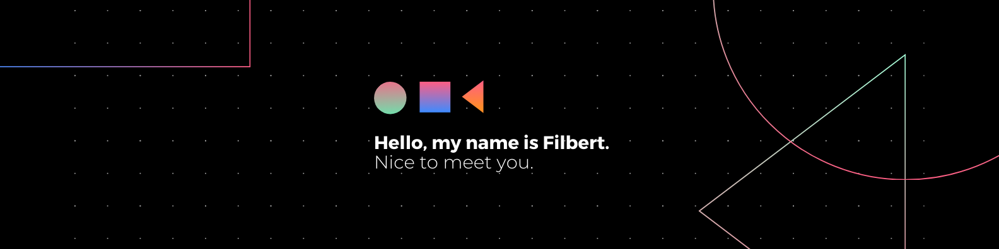

  

###

  
  

###

<h1 align="left">Hey There!, I'm Filbert, an AI Engineer 👋🏻</h1>

###

<h3 align="left">👩‍💻  About Me</h3>

###

🎓 Informatics Major | Computer Science Faculty at President University 🔭 Exploring the World of AI & Computer Vision 🌠 📚 Always learning, experimenting, and exploring the tech universe 💡 ⚡  Code, create, innovate—then repeat 🔥

###

<h3 align="left">🛠 Language and tools</h3>

###

  
  
  
  
  
  
  
  
  
  
  
  
  
  
  
  
  
  
  
  
  
  
  
  
  

###

###

<picture>
  <source media="(prefers-color-scheme: dark)" srcset="https://raw.githubusercontent.com/FilbertSM/FilbertSM/output/github-snake-dark.svg" />
  <source media="(prefers-color-scheme: light)" srcset="https://raw.githubusercontent.com/FilbertSM/FilbertSM/output/github-snake.svg" />
  
</picture>

###